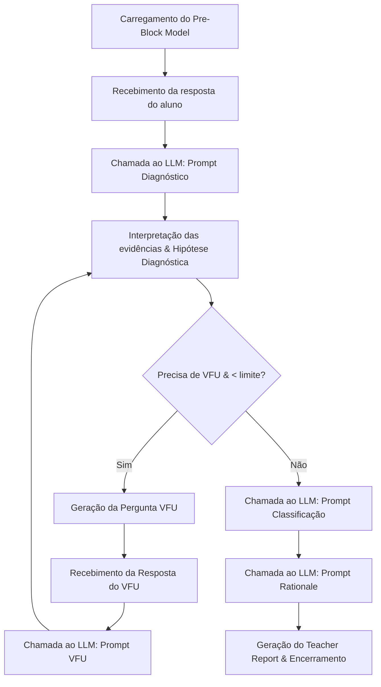

# Seção Técnica Complementar: Implementação do Sistema de Avaliação Formativa com LLM

Este documento detalha a implementação técnica do sistema de avaliação formativa baseado em modelos de linguagem (LLMs), correlacionando as decisões de arquitetura e código-fonte com a metodologia pedagógica descrita no trabalho.

---

## 1. Arquitetura da Solução

A solução adota uma arquitetura cliente-servidor desacoplada (de três camadas lógicas), composta por:

*   **Frontend (Angular):** Desenvolvido utilizando Angular, TypeScript e Angular Material. Ele serve como a interface do usuário, implementando um fluxo de telas (Dashboard, Submissão, VFU, Relatório e Histórico) que reflete o ciclo de vida da avaliação.
*   **Backend (Node.js/Express/TypeScript):** Uma API REST estruturada em controladores (Controllers) e serviços (Services). É responsável pela orquestração do fluxo de avaliação, controle de estado da sessão e persistência de dados.
*   **Comunicação com LLM (OpenAI/Gemini):** O backend consome APIs de modelos generativos (como GPT-4o e Gemini-1.5-Flash) de forma parametrizável. A integração é padronizada através de uma interface comum (`LLMProvider`) e utiliza temperaturas baixas ($0.1$) para garantir determinismo e saídas estritamente formatadas em JSON.
*   **Persistência em JSON:** Os dados são mantidos em arquivos estruturados em disco na pasta `/data`. Essa abordagem orientada a documentos foi escolhida para simplificar a modelagem ágil dos dados e evitar o acoplamento com esquemas rígidos de bancos de dados relacionais durante a fase experimental.

---

## 2. Estrutura de Diretórios

A estrutura de pastas do projeto organiza as responsabilidades da seguinte forma:

*   `backend/` - Diretório principal da API do servidor.
    *   `src/server.ts` - Arquivo de inicialização do servidor Express.
    *   `src/app.ts` - Configuração dos middlewares, CORS e rotas globais.
    *   `src/routes/api.ts` - Definição dos endpoints REST da aplicação (Pre-blocks, Sessions, Evaluations, Demos).
    *   `src/types/index.ts` - Declaração de todas as interfaces e modelos de dados do TypeScript (ex: `PreBlockModel`, `Session`, `DiagnosticHypothesis`, `TeacherReport`).
    *   `src/controllers/` - Camada que intercepta as requisições HTTP, valida entradas simples e retorna as respostas aos clientes.
        *   `evaluation.controller.ts` - Controla as submissões iniciais, respostas a VFUs e sugestões de respostas.
        *   `preblock.controller.ts` - Expõe endpoints para ler os modelos pedagógicos disponíveis.
        *   `session.controller.ts` - Controla a criação, listagem e detalhamento das sessões de alunos.
        *   `demo.controller.ts` - Controla casos de demonstração pré-configurados.
    *   `src/services/` - Camada contendo as regras de negócio e integrações.
        *   `evaluation.service.ts` - Core pedagógico; gerencia a transição de estados da sessão e orquestra as chamadas ao LLM.
        *   `llm.service.ts` - Provedores de comunicação com a OpenAI, Google Gemini e um provedor simulado (`MockProvider`) para testes locais sem chaves de API.
        *   `preblock.service.ts` - Serviço que carrega e lista modelos Pre-Block a partir de arquivos JSON.
        *   `session.service.ts` - Serviço para leitura e gravação física de sessões de estudantes.
    *   `src/prompts/` - Contém as instruções textuais enviadas ao LLM em cada etapa do fluxo.
        *   `diagnostic.prompt.ts` - Prompt para a análise inicial e geração da primeira hipótese de diagnóstico.
        *   `vfu.prompt.ts` - Prompt para reanálise do aluno considerando o histórico de respostas adicionais.
        *   `classification.prompt.ts` - Prompt de classificação final (pedagógica).
        *   `teacher-report.prompt.ts` - Prompt de geração da justificativa narrativa detalhada do professor.
        *   `suggested-answer.prompt.ts` - Prompt auxiliar para sugerir respostas ao aluno em modo de apoio.
*   `data/` - Armazenamento físico estruturado.
    *   `preblocks/` - Contém as definições JSON dos blocos pedagógicos estruturados (ex: `english-past-verbs.json`).
    *   `sessions/` - Guarda o estado de cada sessão ativa ou concluída de avaliação de alunos em arquivos JSON.
    *   `demo-cases/` - Contém casos estruturados simulando diferentes perfis de erros comuns de estudantes.
*   `frontend/` - Aplicação cliente desenvolvida em Angular.
    *   `src/app/pages/` - Componentes visuais organizados por rota: `dashboard/`, `history/`, `submission/`, `vfu/`, `report/`.
    *   `src/app/services/api.service.ts` - Cliente HTTP do frontend para se comunicar com o backend Express.

---

## 3. Fluxo de Execução

O ciclo de vida de uma avaliação no sistema segue um fluxo sequencial e condicional orquestrado pelo backend:



1.  **Carregamento do Pre-Block Model:** O backend carrega o arquivo JSON pedagógico correspondente (ex: `english-past-verbs.json`) no início da sessão.
2.  **Recebimento da resposta do aluno:** O estudante envia o "Artifact" (as frases redigidas em inglês) e a "Narrative" (sua justificativa metalinguística de uso).
3.  **Chamada ao LLM (Diagnóstico):** O `EvaluationService` injeta o Pre-Block, o artefato e a narrativa no `diagnosticPrompt` e envia ao LLM.
4.  **Interpretação das evidências:** O LLM analisa se o texto do aluno fornece evidências para os objetivos do Pre-Block, marcando competências demonstradas e ausentes.
5.  **Geração da hipótese diagnóstica:** O LLM formula a `diagnosticHypothesis` explicando as dúvidas conceituais detectadas no aluno.
6.  **Geração de VFU:** Se houver dúvidas não resolvidas e o limite de VFUs não tiver sido atingido, o LLM define `needVFU = true` e elabora a pergunta de verificação `suggestedVFU`. A sessão transita para o estado `awaiting_vfu`.
7.  **Reanálise:** Após o aluno responder ao VFU, o backend junta as novas respostas ao histórico e executa o `vfuPrompt` no LLM para reavaliar a hipótese.
8.  **Classificação final:** Quando a Stop Rule é atingida (`needVFU = false` ou limite de VFUs alcançado), o backend envia a hipótese final e o histórico ao LLM utilizando o `classificationPrompt`, gerando a classificação pedagógica e a recomendação de progressão.
9.  **Geração do Teacher Report:** O LLM consolida todas as evidências com o `teacherReportPrompt`, gerando a justificativa detalhada (*rationale*) que será gravada no JSON de sessão e exibida na tela do professor.

---

## 4. Implementação do Pre-Block Model

O Pre-Block Model atua como uma restrição lógica baseada em regras pedagógicas, sendo representado por arquivos JSON estruturados. Ele delimita o domínio da avaliação, impedindo o LLM de utilizar critérios subjetivos ou inferências externas.

### Estrutura JSON (ex: [english-past-verbs.json](file:///c:/Faculdade/ia_ingles/data/preblocks/english-past-verbs.json))
```json
{
  "blockId": "english-past-verbs",
  "blockName": "English Past Tense Mastery",
  "learningObjectives": [
    "Recognize regular verbs",
    "Recognize irregular verbs",
    "Use Simple Past correctly",
    "Use Past Participle correctly",
    "Differentiate Simple Past and Present Perfect",
    "Explain grammatical choices"
  ],
  "expectedEvidence": [
    "Correct regular verb formation",
    "Correct irregular verb recognition",
    "Correct Simple Past usage",
    "Correct Past Participle usage",
    "Context-aware tense selection",
    "Ability to explain reasoning"
  ],
  "misconceptionPatterns": [
    "All past verbs end with ed",
    "Went and gone are interchangeable",
    "Past Participle equals Simple Past",
    "Present Perfect can be used with explicit past time markers",
    "Irregular verbs follow regular patterns"
  ],
  "rubricCriteria": [
    "Regular Verb Formation",
    "Irregular Verb Recognition",
    "Simple Past Usage",
    "Past Participle Usage",
    "Context Interpretation",
    "Rule Explanation"
  ],
  "vfuPolicy": {
    "maxVFUs": 2
  }
}
```

O carregamento e mapeamento do Pre-Block no backend ocorrem através do [preblock.service.ts](file:///c:/Faculdade/ia_ingles/backend/src/services/preblock.service.ts):

```typescript
// Trecho de backend/src/services/preblock.service.ts
async getPreBlock(id: string): Promise<PreBlockModel | null> {
  const preblocksPath = this.getPreblocksPath();
  const filePath = path.join(preblocksPath, `${id}.json`);
  
  if (!fs.existsSync(filePath)) {
    return null;
  }

  try {
    const content = fs.readFileSync(filePath, 'utf-8');
    return JSON.parse(content) as PreBlockModel;
  } catch (error) {
    console.error(`Error loading preblock ${id}:`, error);
    return null;
  }
}
```

---

## 5. Implementação da Comunicação com o LLM

A comunicação com os modelos de IA é centralizada em [llm.service.ts](file:///c:/Faculdade/ia_ingles/backend/src/services/llm.service.ts). O design patterns de fábrica/polimorfismo permite trocar dinamicamente o provedor do serviço de IA com o uso de chaves do OpenAI GPT-4o ou Gemini.

A saída em JSON é controlada de forma estrita no nível de API dos provedores e instruída nos prompts.

### Implementação do Provedor OpenAI (usando o recurso nativo JSON Mode):
```typescript
// Trecho de backend/src/services/llm.service.ts
export class OpenAIProvider implements LLMProvider {
  private openai: OpenAI;
  private model: string;

  constructor() {
    const apiKey = process.env.OPENAI_API_KEY;
    if (!apiKey) {
      throw new Error('OPENAI_API_KEY is not defined in the environment variables.');
    }
    this.openai = new OpenAI({ apiKey });
    this.model = process.env.LLM_MODEL || 'gpt-4o';
  }

  async generateJSON<T>(prompt: string): Promise<T> {
    try {
      const response = await this.openai.chat.completions.create({
        model: this.model,
        messages: [
          {
            role: 'system',
            content: 'You are a precise academic evaluator. Always reply in JSON format. Verify your JSON is valid before returning. Translate your educational evaluation to Portuguese.',
          },
          {
            role: 'user',
            content: prompt,
          },
        ],
        response_format: { type: 'json_object' }, // Força a saída do GPT no formato JSON estruturado
        temperature: 0.1, // Temperatura baixa minimiza alucinações e variações criativas
      });

      let text = response.choices[0].message.content || '{}';
      
      // Limpeza de blocos de marcação adicionados pelo LLM se houverem
      const firstBrace = text.indexOf('{');
      const lastBrace = text.lastIndexOf('}');
      if (firstBrace !== -1 && lastBrace !== -1) {
        text = text.substring(firstBrace, lastBrace + 1);
      }

      return JSON.parse(text) as T;
    } catch (error) {
      console.error('Error in OpenAIProvider:', error);
      throw error;
    }
  }
}
```

### Implementação do Provedor Gemini (via chamadas HTTP REST nativas):
```typescript
// Trecho de backend/src/services/llm.service.ts
export class GeminiProvider implements LLMProvider {
  private apiKey: string;
  private model: string;

  constructor() {
    this.apiKey = process.env.GEMINI_API_KEY || '';
    if (!this.apiKey) {
      throw new Error('GEMINI_API_KEY is not defined in the environment variables.');
    }
    this.model = process.env.LLM_MODEL || 'gemini-1.5-flash';
  }

  async generateJSON<T>(prompt: string): Promise<T> {
    try {
      const response = await fetch(
        `https://generativelanguage.googleapis.com/v1beta/models/${this.model}:generateContent?key=${this.apiKey}`,
        {
          method: 'POST',
          headers: { 'Content-Type': 'application/json' },
          body: JSON.stringify({
            contents: [
              {
                role: 'user',
                parts: [{ text: prompt + '\n\nIMPORTANT: Return ONLY a valid JSON object. Translate your educational evaluation to Portuguese.' }],
              },
            ],
            generationConfig: {
              responseMimeType: 'application/json', // Modo JSON nativo do Gemini
              temperature: 0.1,
            },
          }),
        }
      );

      const data = await response.json() as any;
      let text = data.candidates?.[0]?.content?.parts?.[0]?.text || '{}';
      
      const firstBrace = text.indexOf('{');
      const lastBrace = text.lastIndexOf('}');
      if (firstBrace !== -1 && lastBrace !== -1) {
        text = text.substring(firstBrace, lastBrace + 1);
      }

      return JSON.parse(text) as T;
    } catch (error) {
      console.error('Error in GeminiProvider:', error);
      throw error;
    }
  }
}
```

---

## 6. Implementação das Verification Follow-Ups (VFUs)

As perguntas de verificação são ativadas quando há ambiguidades ou indícios de erros conceituais (misconceptions) a serem confirmados ou refutados.

### Decisão de Geração de VFU
O sistema avalia se o LLM marcou `needVFU: true` e se o número de VFUs realizadas ainda está abaixo do limite estipulado pelo Pre-Block Model:

```typescript
// Trecho de backend/src/services/evaluation.service.ts (handleInitialSubmission)
if (hypothesis.needVFU && session.currentVFUCount < preBlock.vfuPolicy.maxVFUs) {
  session.status = 'awaiting_vfu'; // Transiciona o status para reter o fluxo na fase de diálogo
} else {
  session.status = 'completed'; // Stop Rule ativada direta ou por limite
  await this.generateFinalReport(session, preBlock);
}
```

### Armazenamento de Histórico e Reanálise
As interações de VFU são concatenadas no vetor `session.vfuHistory`. Cada resposta inserida dispara o processo de reavaliação utilizando o `vfuPrompt` para fundir o histórico completo:

```typescript
// Trecho de backend/src/services/evaluation.service.ts (handleVFUAnswer)
const currentQuestion = session.latestHypothesis.suggestedVFU;
const historyItem: VFUHistory = {
  question: currentQuestion,
  answer: answer
};
session.vfuHistory.push(historyItem);
session.currentVFUCount++;

const filledPrompt = this.replacePlaceholders(vfuPrompt, {
  PRE_BLOCK: JSON.stringify(preBlock, null, 2),
  ARTIFACT: session.submission.artifact,
  NARRATIVE: session.submission.narrative,
  VFU_HISTORY: this.formatVFUHistory(session.vfuHistory),
  PREVIOUS_HYPOTHESIS: JSON.stringify(session.latestHypothesis, null, 2),
  CURRENT_VFU_COUNT: session.currentVFUCount.toString()
});

const hypothesis = await this.llmProvider.generateJSON<DiagnosticHypothesis>(filledPrompt);
historyItem.hypothesisAfterVFU = hypothesis;
session.latestHypothesis = hypothesis;
```

---

## 7. Implementação das Classificações

A classificação final do estudante ocorre no método privado `generateFinalReport` dentro do [evaluation.service.ts](file:///c:/Faculdade/ia_ingles/backend/src/services/evaluation.service.ts). Ele consome dois prompts estruturados de forma sequencial:
1.  **`classificationPrompt`:** Responsável por categorizar rigidamente o estudante.
2.  **`teacherReportPrompt`:** Compila e formata a justificativa do diagnóstico para o professor.

### Regras de Classificação no Código
As três categorias metodológicas mapeadas são:
*   **`Completely Correct`:** O aluno demonstrou todos os objetivos pedagógicos sem cometer erros conceituais significativos. A recomendação gerada é **`Proceed`** (Prosseguir).
*   **`Partially Correct`:** O aluno apresentou compreensão parcial, porém restaram algumas lacunas ou desvios menores já corrigidos ou que necessitam de apoio. A recomendação associada é **`Conditional Progression`** (Progressão Condicional).
*   **`Completely Incorrect`:** O aluno demonstrou falta de domínio dos objetivos básicos ou falhou em sanar misconceptions conceituais cruciais. A recomendação associada é **`Rework`** (Retrabalho completo).

O código realiza este processo enviando as variáveis pedagógicas e obtendo a classificação correspondente:

```typescript
// Trecho de backend/src/services/evaluation.service.ts
private async generateFinalReport(session: Session, preBlock: PreBlockModel): Promise<void> {
  const latestHypothesis = session.latestHypothesis;
  if (!latestHypothesis) {
    throw new Error('Cannot generate final report without a diagnostic hypothesis');
  }

  // 1. Geração da classificação estruturada
  const filledClassificationPrompt = this.replacePlaceholders(classificationPrompt, {
    PRE_BLOCK: JSON.stringify(preBlock, null, 2),
    ARTIFACT: session.submission.artifact,
    NARRATIVE: session.submission.narrative,
    VFU_HISTORY: this.formatVFUHistory(session.vfuHistory),
    LATEST_HYPOTHESIS: JSON.stringify(latestHypothesis, null, 2)
  });

  const classResult = await this.llmProvider.generateJSON<{
    classification: 'Completely Correct' | 'Partially Correct' | 'Completely Incorrect';
    recommendation: 'Proceed' | 'Conditional Progression' | 'Rework';
    confidence: 'low' | 'medium' | 'high';
    mainGap: string;
    deficiencyProfile: string[];
  }>(filledClassificationPrompt);

  // 2. Geração da justificativa narrativa detalhada (Rationale)
  const filledReportPrompt = this.replacePlaceholders(teacherReportPrompt, {
    PRE_BLOCK: JSON.stringify(preBlock, null, 2),
    ARTIFACT: session.submission.artifact,
    NARRATIVE: session.submission.narrative,
    VFU_HISTORY: this.formatVFUHistory(session.vfuHistory),
    LATEST_HYPOTHESIS: JSON.stringify(latestHypothesis, null, 2),
    CLASSIFICATION: classResult.classification,
    RECOMMENDATION: classResult.recommendation,
    MAIN_GAP: classResult.mainGap,
    DEFICIENCY_PROFILE: JSON.stringify(classResult.deficiencyProfile),
    DEFICIENCY_PROFILE_ITEMS: classResult.deficiencyProfile.map(item => `"${item}"`).join(', ')
  });

  const finalReport = await this.llmProvider.generateJSON<TeacherReport>(filledReportPrompt);
  
  session.teacherReport = {
    classification: classResult.classification,
    recommendation: classResult.recommendation,
    confidence: classResult.confidence,
    mainGap: classResult.mainGap,
    deficiencyProfile: classResult.deficiencyProfile,
    rationale: finalReport.rationale || 'Avaliação concluída com sucesso.'
  };
}
```

---

## 8. Persistência em JSON

A persistência do estado baseia-se na serialização completa de objetos em arquivos JSON dentro de `data/sessions/`. 

### Estrutura do Arquivo de Sessão (Exemplo de gravação física real)
Quando o sistema armazena uma sessão, ele escreve o histórico de submissões do estudante, os diálogos estruturados de VFU, a evolução do diagnóstico passo a passo e o relatório final do professor.

```json
{
  "sessionId": "sess_1718712345678_abcd123",
  "preBlockId": "english-past-verbs",
  "submission": {
    "artifact": "Yesterday I drinked water and have gone to school.",
    "narrative": "Usei 'drinked' como passado de 'drink' e o Present Perfect com 'yesterday' porque a ação acabou."
  },
  "vfuHistory": [
    {
      "question": "Você utilizou as palavras 'drinked' e 'goed'. Como você formaria o passado simples desses verbos que são irregulares em inglês?",
      "answer": "O passado de drink é drank e o de go é went.",
      "hypothesisAfterVFU": {
        "demonstratedCompetencies": [
          "Recognize regular verbs",
          "Recognize irregular verbs"
        ],
        "missingCompetencies": [
          "Differentiate Simple Past and Present Perfect"
        ],
        "misconceptionsDetected": [
          "Present Perfect can be used with explicit past time markers"
        ],
        "confidence": "medium",
        "needVFU": true,
        "diagnosticHypothesis": "O aluno corrigiu os verbos irregulares para drank/went, demonstrando que os conhece. Permanece o erro do Present Perfect com yesterday.",
        "suggestedVFU": "Na sua frase 'Yesterday I have gone to school', por que o Present Perfect 'have gone' está incorreto ao lado de 'yesterday'?"
      }
    }
  ],
  "status": "awaiting_vfu",
  "currentVFUCount": 1,
  "latestHypothesis": {
    "demonstratedCompetencies": [
      "Recognize regular verbs",
      "Recognize irregular verbs"
    ],
    "missingCompetencies": [
      "Differentiate Simple Past and Present Perfect"
    ],
    "misconceptionsDetected": [
      "Present Perfect can be used with explicit past time markers"
    ],
    "confidence": "medium",
    "needVFU": true,
    "diagnosticHypothesis": "O aluno corrigiu os verbos irregulares para drank/went, demonstrando que os conhece. Permanece o erro do Present Perfect com yesterday.",
    "suggestedVFU": "Na sua frase 'Yesterday I have gone to school', por que o Present Perfect 'have gone' está incorreto ao lado de 'yesterday'?"
  },
  "createdAt": "2026-06-18T02:40:00.000Z",
  "updatedAt": "2026-06-18T02:41:30.000Z"
}
```

### Justificativa da Escolha por JSON:
1.  **Sem Impedância de Mapeamento (No Object-Relational Impedance Mismatch):** O objeto de estado `Session` possui um comportamento altamente aninhado e hierárquico (histórico de VFUs dinâmicos que contêm sub-hipóteses). Mapear isso para tabelas relacionais SQL exigiria múltiplas tabelas e junções complexas.
2.  **Auditabilidade Pedagógica Total:** Cada arquivo JSON contém uma "caixa preta" completa de uma submissão de aluno, documentando de forma legível por humanos a trilha exata de diagnóstico que a IA gerou em cada passo.
3.  **Simplicidade e Agilidade:** Elimina a infraestrutura de banco de dados, facilitando a portabilidade do protótipo acadêmico para rodar de forma isolada em qualquer máquina estudantil/docente.

---

## 9. Relação Entre Código e Metodologia

A tabela a seguir mapeia os conceitos formais da metodologia pedagógica com a sua tradução física no código-fonte do projeto:

| Conceito Pedagógico | Tradução Física no Código (Componente e Linha/Arquivo) | Exemplo de Funcionamento Prático na Implementação |
| :--- | :--- | :--- |
| **Pre-Block Model** | [preblock.service.ts](file:///c:/Faculdade/ia_ingles/backend/src/services/preblock.service.ts) e arquivo [english-past-verbs.json](file:///c:/Faculdade/ia_ingles/data/preblocks/english-past-verbs.json) | Delimita os alvos da avaliação: `learningObjectives` (ex: *"Differentiate Simple Past and Present Perfect"*) e `misconceptionPatterns` que a IA deve buscar. |
| **Evidence Interpretation** | `demonstratedCompetencies` e `missingCompetencies` mapeados em `DiagnosticHypothesis` ([types/index.ts](file:///c:/Faculdade/ia_ingles/backend/src/types/index.ts#L18)) | O LLM lê o artefato do aluno e extrai explicitamente as evidências, como associar *"drinked"* a *"All past verbs end with ed"*. |
| **Diagnostic Hypothesis** | Campo `diagnosticHypothesis` gerado no `EvaluationService.handleInitialSubmission` ([evaluation.service.ts](file:///c:/Faculdade/ia_ingles/backend/src/services/evaluation.service.ts#L106)) | A IA redige um parágrafo estruturado descrevendo a lacuna do estudante, ex: *"O aluno aplica a regra regular -ed a verbos irregulares e demonstra confusão com advérbios."* |
| **Verification Follow-Up** | Atributos `needVFU` e `suggestedVFU` em `DiagnosticHypothesis` ([types/index.ts](file:///c:/Faculdade/ia_ingles/backend/src/types/index.ts#L23)) | Se houver ambiguidade no diagnóstico, a IA gera perguntas como *"Como você formaria o passado simples de 'drink'?"* para investigar se o erro foi lapso ou falta de conhecimento. |
| **Stop Rule** | Estruturas condicionais avaliadas em `evaluation.service.ts` ([evaluation.service.ts](file:///c:/Faculdade/ia_ingles/backend/src/services/evaluation.service.ts#L109-L114) e [evaluation.service.ts](file:///c:/Faculdade/ia_ingles/backend/src/services/evaluation.service.ts#L160-L165)) | Interrompe a geração de novas VFUs quando `needVFU == false` (dúvidas resolvidas) ou quando a contagem atinge `maxVFUs` (2 perguntas). |
| **Final Classification** | Campo `classification` retornado pelo `classificationPrompt` ([prompts/classification.prompt.ts](file:///c:/Faculdade/ia_ingles/backend/src/prompts/classification.prompt.ts#L38)) | Atribui a categoria final do aluno: `"Completely Correct"`, `"Partially Correct"` ou `"Completely Incorrect"`. |
| **Teacher Recommendation**| Campo `recommendation` gerado e armazenado em `Session.teacherReport` ([types/index.ts](file:///c:/Faculdade/ia_ingles/backend/src/types/index.ts#L36)) | Traduz a classificação pedagógica em ação prática para o professor: `"Proceed"`, `"Conditional Progression"` ou `"Rework"`. |

Esta rigorosa tradução de conceitos garante que o comportamento da Inteligência Artificial Generativa seja previsível, replicável e estritamente auditável sob o ponto de vista da pesquisa pedagógica.
